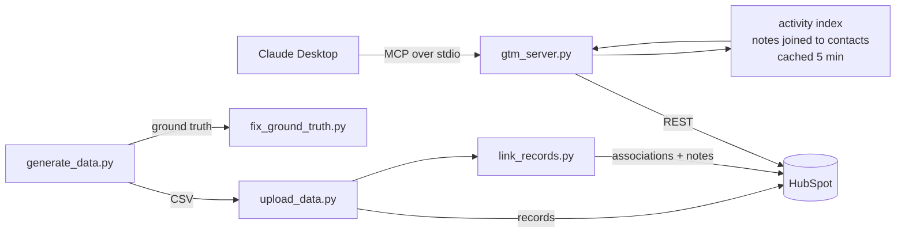

# GTM Agent Layer

An MCP server for HubSpot whose tools are shaped like questions instead of like database tables.

HubSpot ships an official MCP server. I tested it first, found where it breaks down, and built a different one. This repo has both the benchmark and the server.

---

## The short version

Same HubSpot portal. Same questions. Same client. Both servers speak MCP and both read the HubSpot REST API. The only difference is how the tools are designed.

| Question | Official server | GTM Agent Layer |
|---|---|---|
| Deals with no activity in 30 days | 7 calls → **0 found** | 2 calls → **112 found** |
| Which deals are stalling, and what to say | 13 calls → **gave up** | 3 calls → **6 tailored follow-ups** |
| Which channel sends leads that don't close | 21 calls → **"no channel data"** | 2 calls → **paid_social, 3.4%** |
| Full picture on a company by name | 5 calls → **complete** | 1 call → **could not answer** |

Full logs in [`benchmark/`](benchmark/).

---

## The problem

Most CRM integrations expose tools that mirror the object model. One tool for contacts, one for deals, one for companies, one for notes. It's a faithful representation of how the data is stored.

The trouble is that almost no real question maps to a single object.

"Which deals have gone quiet" needs deals joined to contacts joined to engagement history. With object-shaped tools, the agent has to perform that join itself, one fetch at a time, deciding as it goes whether it has enough. Three things follow:

**It's expensive.** Many round trips instead of one.

**It reasons worse.** The model ends up holding a pile of raw records and trying to make sense of all of them at once.

**It can stop early without saying so.** The agent decides when it has fetched enough. Sometimes it decides wrong, and the answer arrives sounding completely confident.

That third failure is the one that costs money, and it's what the benchmark found.

---

## What the benchmark found

I loaded a test portal with 120 companies, 612 contacts, 400 deals, and 2,942 notes carrying backdated timestamps across the past year. Then I asked HubSpot's official MCP server six questions.

**It never read the engagement history.** Across five runs and roughly 53 tool calls, it did not query a single note. It reached for `hs_lastmodifieddate`, then `hs_analytics_source`, then `createdate`, and repeatedly offered to check activity "if pointed at specific deals." The data that answers "who has gone quiet" sat untouched the whole time.

**More retrieval did not mean more accuracy.** Its worst answer took its most calls. Twenty-one lookups to conclude the CRM had no channel data. The channel was in a custom property it never found.

**The same question produced opposite outcomes.** Asked twice in separate sessions, it first spent 13 calls and declined to answer, then spent 9 and produced something useful. Same question, same tools, same data. Object-shaped tools supply no strategy, so the agent improvises one per session. A rep who gets nothing on Monday does not ask again on Tuesday.

To be fair to it: its object retrieval is solid, it hedged rather than fabricating, and it correctly diagnosed the data as a bulk import. The gap is in cross-object reasoning, which is where most go-to-market questions live.

---

## The four tools

```python
lead_context(email)
```
Contact, company, every deal, and full engagement history in one call. Replaces the search-then-fetch-then-fetch-then-fetch sequence.

```python
find_stale_deals(days=30, limit=25)
```
Open deals where nobody has talked to the contact in N days. Measured from logged activity, not from when the record was last edited. Each result already carries contact, company, value, stage, and days silent, so no follow-up lookups are needed to write outreach.

```python
pipeline_health(include_closed=False)
```
Open pipeline by stage: deal count, value, and average age, in pipeline order.

```python
segment_performance(dimension="acquisition_channel", min_closed=12)
```
Win rate by segment, computed from closed deals only, sorted worst first.

---

## Design decisions

**Engagement history is never optional.** Every staleness question joins notes to contacts to deals, always. This single decision is the difference between 112 and 0 on the first benchmark question.

**Thin segments are reported but not ranked.** `segment_performance` excludes anything under 12 closed deals from the best/worst call. A channel with four closed deals can look catastrophic on noise alone. A tool that says "not enough data to say" is more trustworthy than one that always names a loser.

**Payloads are written for a language model.** Relative dates ("34 days ago") instead of ISO timestamps. Stage labels ("Qualified To Buy") instead of internal IDs (`qualifiedtobuy`). Nulls collapsed.

**Every response carries a `summary` line** with the finding already derived, so the agent can answer without parsing the payload.

**Reads only.** No write tools. An agent with CRM access should be able to prepare work and never be able to embarrass you in front of a customer.

---

## Architecture



The activity index is the piece that makes staleness answerable. Building it costs a handful of batched calls, so it's cached for five minutes. Someone asking three pipeline questions in a row shouldn't pay for it three times.

---

## The data

Synthetic, generated by [`generate_data.py`](generate_data.py), seeded so every run produces identical output. No real customer data anywhere.

The generator deliberately builds in mess, because real CRMs have it:

- ~8% of contacts with no email address
- 12 duplicate contacts, same person under two domains
- One channel (`paid_social`) converting at 3.4% against ~25% elsewhere
- Deal ages from 2 to 270 days
- Long-tail engagement: most contacts with one or two touches, a handful with twenty

It also writes `ground_truth.json` recording the correct answers, which is what makes the benchmark gradeable rather than impressionistic.

Volume was sized so the planted channel signal clears the noise floor. At smaller volumes a channel with four closed deals and no wins would outrank the one designed to underperform, and the benchmark question would have no defensible answer.

---

## Setup

```bash
pip install fastmcp requests python-dotenv faker
cp .env.example .env          # add your HubSpot private app token
python check_pipeline.py      # confirm your portal's stage IDs
python generate_data.py
python upload_data.py
python link_records.py
python fix_ground_truth.py
```

Required scopes: read and write on contacts, companies, deals, and notes, plus `crm.schemas.*.write` for creating custom properties.

Then add to `claude_desktop_config.json`:

```json
{
  "mcpServers": {
    "gtm-agent-layer": {
      "command": "/full/path/to/python3",
      "args": ["/full/path/to/gtm_server.py"],
      "env": { "HUBSPOT_TOKEN": "your-token" }
    }
  }
}
```

---

## Gotchas

Things that cost me time, in case they save you some.

**Deal stages are internal IDs, not labels.** `appointmentscheduled`, never "Appointment Scheduled." Custom pipelines use generated numeric IDs with no readable form at all. Run `check_pipeline.py` and use what it returns.

**`industry` is an enumeration.** Only fixed values like `COMPUTER_SOFTWARE`. Invent a label and the whole batch is rejected.

**Batch endpoints are all-or-nothing.** One bad value kills the other 99. Print `response.text` on failure; HubSpot's errors name the offending property and sometimes list every allowed value.

**Batch create does not guarantee response ordering.** This is the one that actually hurt. Zipping inputs against results silently assigns the wrong ID to the wrong record, and everything looks fine until a contact shows up linked to a stranger's company. Stamp each record with its own reference and match on that.

**Association type IDs vary by portal.** Passing a wrong one fails silently: the record is created, the link is not. Use the v4 default endpoint and let the API pick.

**`createdate` is read-only on contacts** but settable on deals. `hs_timestamp` on notes is settable, which is what makes backdated activity possible.

**Object permissions and schema permissions are different.** Reading and writing records does not let you create a custom property.

**Python from python.org doesn't use the macOS certificate store.** Run its `Install Certificates.command` before anything makes an HTTPS request.

**Claude Desktop can't read files in Desktop, Documents, or Downloads** without explicit permission. The error says "Operation not permitted," not "file not found." Keep the project in your home directory.

**HubSpot's remote server won't authenticate through Claude Code.** Its OAuth server doesn't support dynamic client registration, which Claude Code requires. No workaround from the client side. Benchmark was run in Claude Desktop for that reason.

**Disable one server before testing the other.** With both connected, the client picks, and my first benchmark run measured the wrong server.

---

## Known limitations

**No company-level entry point.** `lead_context` takes an email. Asked about a company by name, the server has to ask for a contact instead. The official server handles this cleanly and this one doesn't. Logged rather than patched so the comparison stays honest.

**Stale counts drift.** Ground truth is computed at generation time while the staleness threshold moves with the clock. About three deals per day cross the 30-day line.

**Deal age and contact silence are independent in the generated data.** A few rows show a recent deal whose contact has been silent for months, which couldn't happen in a real CRM. The staleness measure is correct; the synthetic data is inconsistent in those cases.

**The two benchmark runs were not simultaneous.** The official server was tested against an earlier state of the portal. The behavioral findings hold, since it never queried engagement history at all, but the runs weren't back to back.

---

## What this is not

Not a criticism of MCP. Both servers use the protocol and it works fine. The finding is about tool design, not about the protocol.

Not a claim that generic tools are useless. They handle single-object questions well. They struggle when a question needs a join.